# AI-Exam
Created by the group Pejomi (Peter, Jonas & Mie)

This is a AI exam project for the course "Artificial Intelligence" at the Cphbusiness Lyngby campus. Below you will find a description of the project, the data used and the results of the project.

## Introduction
Traffic accidents are a major cause of death and injury worldwide. In the UK alone, there are over 100,000 accidents every year ([UK government](https://www.gov.uk/government/statistics/reported-road-casualties-great-britain-annual-report-2020)). By using AI, we can predict the likelihood of a car accident given certain conditions. This can help us to understand the causes of accidents and take steps to prevent them.

## Business scenario
SafeWay is a company working with artificial intelligence and machine learning to provide tools for investigating and predicting car accidents.

Their service is based on a large dataset of car accidents in the UK, which includes information about the weather, road conditions, time of day, the driver involved and other factors leading up to the accident.

With the data they want to provide a services such as a chatbot that can answer questions about car accidents, a machine learning model that can predict the likelihood of a car accident given certain conditions, and a simulation environment for training autonomous cars.

## Problem statement
With the business scenario in mind, we want to investigate the following questions and hypothesis for this project:

**Research questions:**
- Can we predict the likelihood of a car accident given certain conditions?
- Can we use AI to simulate car accidents and train autonomous cars?
- How can we use AI to provide a chatbot that can answer questions about car accidents?

**Hypothesis:**
- **Weather Impact Hypothesis**: There is a statistically significant relationship between specific weather conditions (such as rain, snow, or fog) and the frequency and severity of car accidents. This could be explored through correlation analysis and regression models.

- **Time Dependency Hypothesis**: The likelihood of accidents varies significantly with the time of day and week. For instance, late-night and early-morning hours might have higher accident rates due to reduced visibility or increased likelihood of drivers being impaired or fatigued.

- **Driver Characteristics Hypothesis**: Certain driver demographics (age, driving experience) and behaviors (speeding, use of mobile phones) are strong predictors of accident likelihood. Machine learning classification models like logistic regression or decision trees can be used to analyze these factors.

- **Road Conditions Hypothesis**: Poor road conditions (such as potholes, lack of proper signage) are crucial predictors of accidents. This hypothesis can be validated using spatial analysis techniques and machine learning models that incorporate GIS data.

- **Predictive Model Effectiveness Hypothesis**: Machine learning models based on the available dataset can predict car accidents with a precision and recall above a certain threshold, making them practical for real-world applications. Model performance can be measured using metrics like accuracy, AUC-ROC, precision, recall, and F1-score.

- **Chatbot Utility Hypothesis**: A chatbot trained on the accident dataset can accurately answer queries related to accident statistics, contributing factors, and preventive measures with a high satisfaction rate among users.

- **Simulation Effectiveness Hypothesis**: Simulations based on real-world data can effectively train autonomous vehicles to identify and react to potential hazards, reducing the likelihood of accidents when compared to traditional training methods.


## The application
Below is a diagram of the current overall structure of the project.

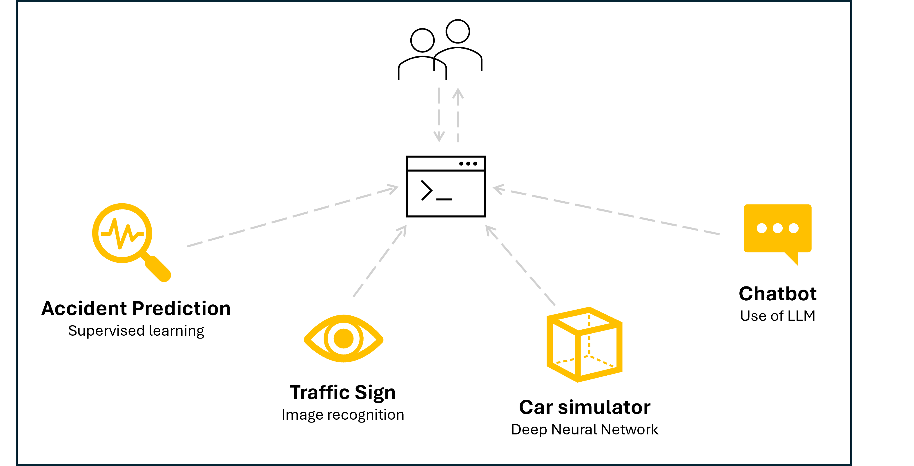

The following sections describe the different parts of the project in more detail.

---

### Accident prediction
#### Accident Severity Prediction Model Using Artificial Neural Networks

Our project presents an advanced machine learning model designed to predict the severity of road accidents. We are using an Artificial Neural Networks (ANN), our model analyzes various factors contributing to accident outcomes, such as weather conditions, speed limits, road type, and driver behavior.

The model has been trained using official traffic accident statistics from the UK, spanning the years 2005 to 2016. By processing and learning from this extensive historical dataset, the ANN-based model predicts the severity of accidents at three distinct levels: Slight, Serious, and Fatal. These predictions can assist in proactive safety measures.

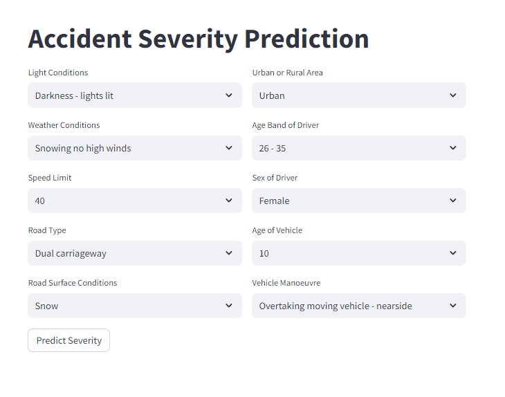

#### Model summary

The accident severity prediction model employs a Sequential neural network architecture with three dense layers:

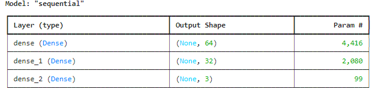

#### Area Under the Curve (AUC) score
```
if len(y_pred[0]) > 2:  # Multi-class classification
    from sklearn.metrics import roc_auc_score

    # Calculate AUC score
    auc_score = roc_auc_score(y_test, y_pred, multi_class='ovr')
    print(f"AUC Score: {auc_score}")
```

`AUC Score: 0.7065744268949956`

We have done an evaluation of our model's performance by using the Area Under the Curve (AUC) score, which measures its ability to distinguish between different classes of accident severity. With an AUC score of 0.7066 it indicates that the model has a good level of discriminatory power, it successfully predicting the severity of accidents with a reasonable degree of accuracy. The score demonstrates that the model can differentiate between Slight, Serious, and Fatal accidents effectively, although there is still room for improvement.
<br><br>
#### Accident Severity Prediction Model Using a Decision Tree Classifier

In addition to the ANN model, we have also developed a Decision Tree Classifier model to compare the two, and see which is best suited for a scenario like ours. The Decision Tree Classifier is a supervised machine learning algorithm that uses a tree-like graph of decisions and their possible consequences to predict the severity of accidents.

The input features for the Decision Tree Classifier model are the same as for the ANN model. The model has been trained on the same dataset of UK traffic accident statistics.

#### Performance evaluation (Area Under the Curve (AUC) score)

The Decision Tree Classifier model has an AUC score of 0.530, which is lower than the ANN model's AUC score of 0.706. This indicates that the ANN model is better at predicting the severity of accidents than the Decision Tree Classifier model.
Even though the Decision Tree Classifier model is easier to interpret and visualize, which can be useful for understanding the factors that contribute to the severity of accidents.

We extracted the Feature Importances from the Decision Tree Classifier model to see which features are most important for predicting the severity of accidents. The importance of the features sorted in descending order is as follows:

```
Time       0.441
Age        0.322
Vehicle    0.085
Road       0.051
Weather    0.035
Speed      0.032
Light      0.021
Urban      0.009
Sex        0.004
```

The Feature Importances show that the most important features for predicting the severity of accidents are Time and Age, which accounts for around ```((0.441 + 0.322) * 100) ≈ 76%``` of the total importance.

#### Performance evaluation (Accuracy)

In Machine Learning, accuracy is a measure of how well a model can predict the correct outcome. It is calculated by dividing the number of correct predictions by the total number of predictions. The Decision Tree Classifier model has an accuracy of 0.77, which means that it can predict the severity of accidents with a 77% accuracy rate. This is a good result, but there is still room for improvement.

---

### Car Simulator
By using the Unity Game Engine and the MLAgents package, we have developed a car simulator that can be used to train a reinforcement learning model to drive a car. The simulator is a 3D environment where the car has to follow a pre-defined road, which the model has to learn to do by itself by using only the car's "Ray Perception Sensors" as input.

Below, the car can be seen with its 2x15 ray-sensors activated and visualized:

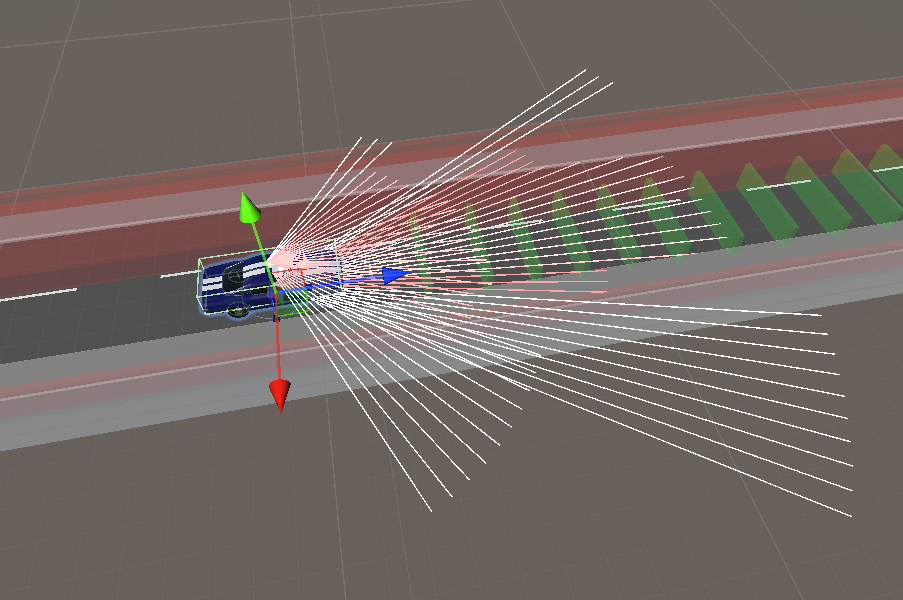

Each sensor generates a value of 1 if it detects an object, or 0 if it doesn't, as well as the distance to where the ray hit the object. The model then has to learn to interpret these values and use them to steer the car in the right direction.

As the learning method is reinforcement learning, the model is rewarded for staying on the road, and penalized for driving off the road. The model is trained using the Proximal Policy Optimization (PPO) algorithm, which is a type of reinforcement learning algorithm that is well-suited for continuous action spaces.

Training a model like this can take a long time, and a lot of resources over multiple generations. For this reason, we chose to generate data for the car with 2 ray-sensors with 15 rays each, as this generates an input vector with a size of 60. In comparison, an RGB camera-sensor with even a low resolution of 256x256 would produce an input vector with the size of 196,608. 

This input vector is generated by each instance of the environment, and has to be processed by the model in each step of the training process. By using the ray-sensors, we can reduce the size of the input vector by a factor of over 3,000, which greatly reduces the amount of resources needed to train the model.

Below is an example of the progress achieved by a training process which used 158 instances of the environment to collectively train the model for 5,000,000 steps. The clip shows a 13 minute training session boiled down to 30 seconds:

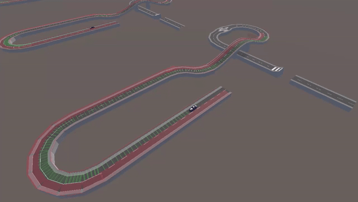

---

### Traffic Sign Detection
#### Data generation 
At first, we used the traffic sign dataset from the German Traffic Sign Recognition Benchmark (GTSRB) as the data for training a model to recognize traffic signs. However, the dataset was too small (around 900 images in total) to train a model that could generalize well to real-world images. To solve this problem, we utilized the Unity Game Engine to generate synthetic data.

The synthetic data generation required 2 main parts. 

The first part is a collection of background images from a relevant environment, in this case urban and/or rural traffic environments.

An example of such an image could be like the following, which was simply found on google:

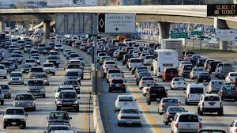

The second part is a collection of traffic sign "prefabs", which are blueprints of 3D objects that unity can manipulate and apply methods to. This includes scaling, rotating, and translating the objects, as well as applying textures to them.

These 3D objects are a combination of simple shapes, and textures that are applied to them. The textures in our case were the following collection of images:

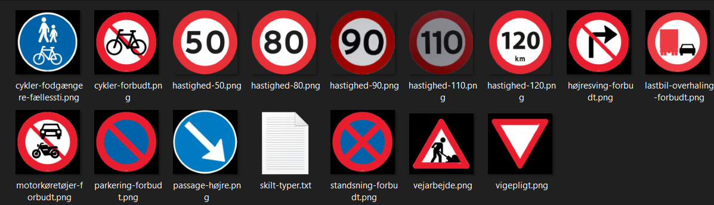
 
We used Unity to combine these parts in random ways, and thereby managed to develop a solution which could generate any given amount of synthetic images, which gives us an unlimited amount of training data for our traffic sign recognition model.

An example of such a generated image could be the following:

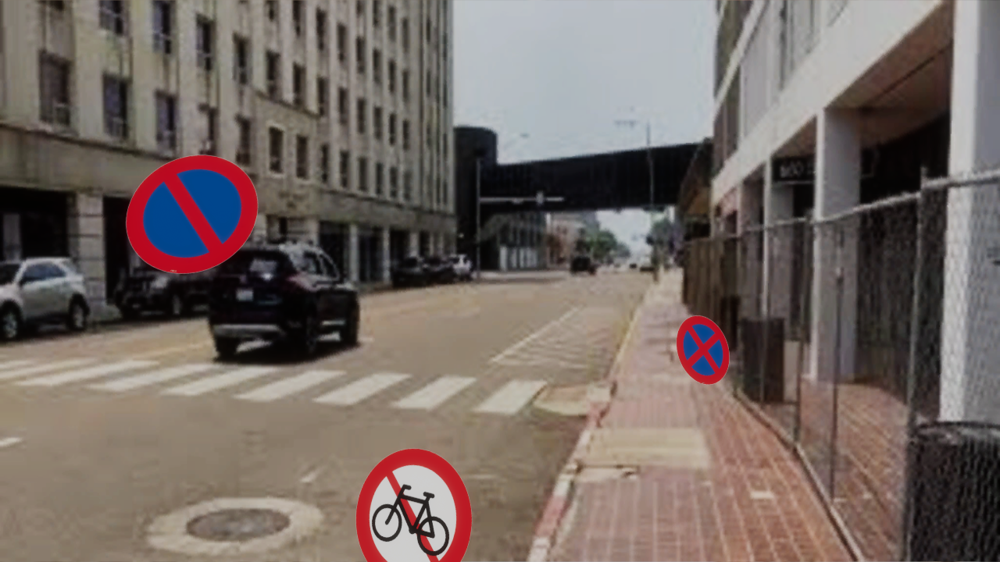

 
#### Prediction
For prediction, we used the YOLO model, which is a pre-trained CNN model that can detect objects in images. We trained the model on the synthetic data we generated in Unity, and then used it to predict traffic signs in real images.

During the training process, the YOLO training script outputs a collection of validation images with the predicted bounding boxes drawn on them, which is used to get a general idea of the models accuracy. An example of such an image could be the following:

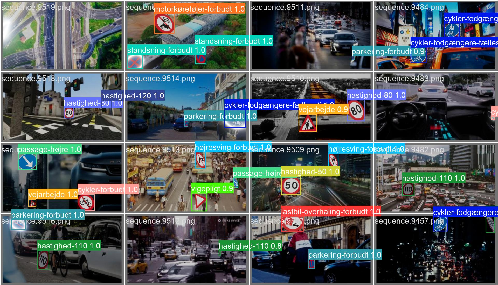

In that validation-batch, the model seems to achieve a high accuracy, as it predicts most of the taffic signs correctly with a high certainty.

We also tested the model on real images, and it seems to perform well on those as well. An example of the output of such a prediction could be the following:

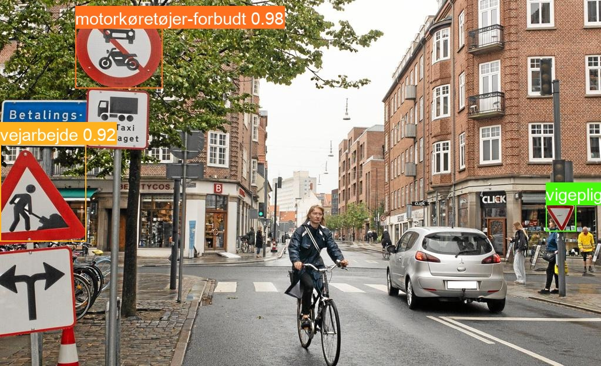

Our end goal is to combine this model with the car simulator, so that the car can detect traffic signs in real-time, and react to them accordingly.

---

### Chatbot
The chatbot is a simple question-answering system that can answer questions about traffic, car accidents and road safety, based on a pre-trained language model with vectorized data from the UK government and European Union


#### Vectorize our data
After collecting and splitting our data, we need to vectorize it. With Chroma we store our data in a vectorized format. This allows us to easily access and manipulate the data in a structured way.

To vectorize our data, we use the HuggingFace embeddings. HuggingFace is a library that provides pre-trained embeddings for natural language processing tasks.

```python	
    model_name = "sentence-transformers/all-mpnet-base-v2"
        model_kwargs = {'device': 'cpu'}
        encode_kwargs = {'normalize_embeddings': False}
        embeddings = HuggingFaceEmbeddings(
            model_name=model_name,
            model_kwargs=model_kwargs,
            encode_kwargs=encode_kwargs
        )
```

#### Use of Model
We use the **Mistral (7B)** language model from Ollama to train our chatbot. There is some advantages of using Mistral for this project:
- **Performance**: Mistral is specifically designed for complex tasks that require deep understanding and sophisticated processing of language, making it well-suited for applications in predictive analytics and natural language understanding​​.
- **Multilingual Support**: Mistral Large supports multiple languages with high proficiency, including English, French, Spanish, German, and Italian. This feature is particularly advantageous for SafeWay if they plan to expand their services to international markets or need to process data from diverse linguistic sources​​.
-**Advanced Features**: The model supports a 32K token context window, which is crucial for maintaining context in long interactions or documents. This would be beneficial for analyzing lengthy accident reports or complex queries in SafeWay's chatbot​​.

#### Demonstration of the chatbot
We have here listed some examples of questions that the chatbot can answer:

- What are the most common causes of car accidents?
- How can I prevent a car accident?
- What should I do if I am involved in a car accident?

Below is a screenshot of the chatbot displayed on the Streamlit app:

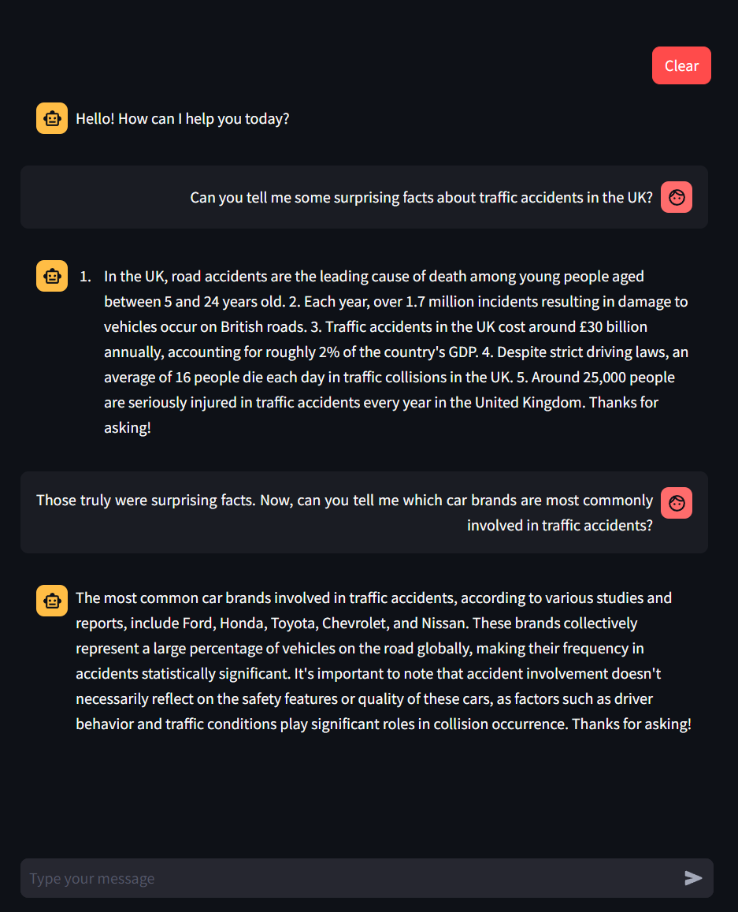

## Data
We have used the following data sets in this project:

- **Traffic accident in UK data set**: The data set contains information about car accidents in the UK. [Link to the data set](https://www.kaggle.com/datasets/tsiaras/uk-road-safety-accidents-and-vehicles?select=Accident_Information.csv)
- **Traffic sign images data set**: we use some pictures founded on google to train our model to recognize traffic signs.
- **Wiki pages**: We have used the Wikipedia API to get information about traffic signs and road safety.
- **PDFs**: We have used pdfs from the UK government and European Union to get information about road safety and traffic accidents. (See the folder ```llm/data/lib/pdf```)

The data is used in the following parts of the project:

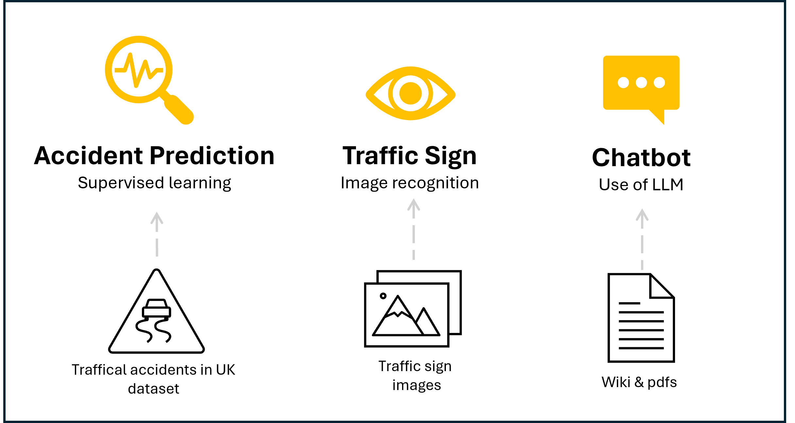

## Conclusion
In this project we have investigated the use of AI to predict the likelihood of a car accident given certain conditions. We have trained a machine learning model to predict the likelihood of a car accident based on the input features. 

We have also used AI to simulate car accidents and train autonomous cars. We have created a simulation environment that can be used to train autonomous cars to avoid accidents.

Finally, we have used AI to provide a chatbot that can answer questions about car accidents. The chatbot is a simple question-answering system that can answer questions about traffic, car accidents and road safety.

## Future work
In the future, we would like to improve the accuracy of the machine learning model and the chatbot. We would also like to add more features to the simulation environment, such as the ability to simulate different types of accidents and road conditions.

To use it in a real-world scenario, we wanted to integrate the different parts of the project into a single application to be used for a car. Below is a drawing of the future work of the project:

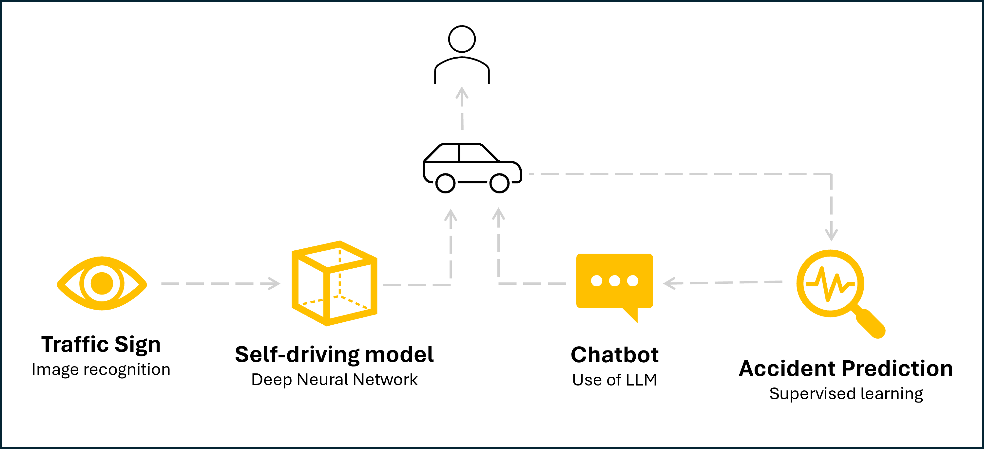

## Run the project

### Requirements
You will need to have [**Ollama**](https://www.ollama.com/) installed to run the project. You can install Ollama using the following command:

```bash
pip install ollama
```

Furthermore, you will need to run the 'Mistral' (7B model) from Ollama to run the chatbot. You can do this by running the following command:

```bash
ollama run mistral
```

### Start application
To start the application, run the following command:

```bash
cd streamlit_app
streamlit run app.py
```