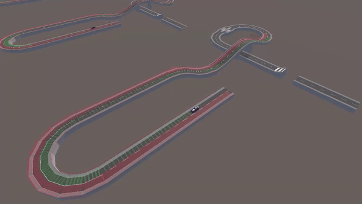
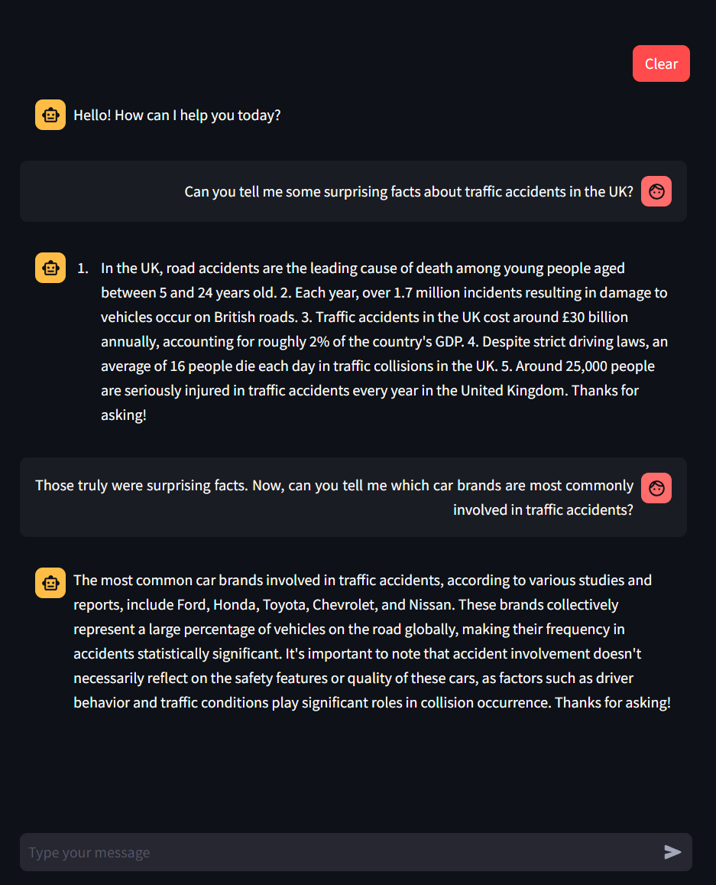
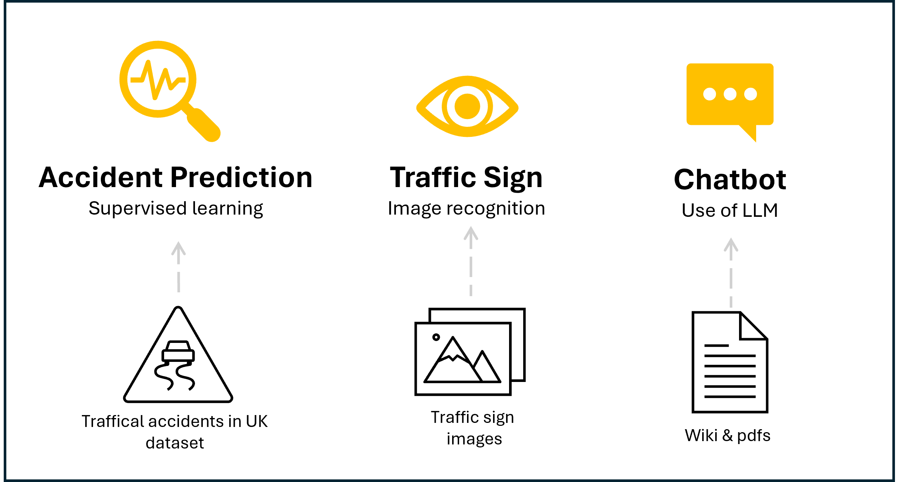

# AI-Exam
Created by the group Pejomi (Peter, Jonas & Mie)

This is a AI exam project for the course "Artificial Intelligence" at the Cphbusiness Lyngby campus. Below you will find a description of the project, the data used and the results of the project.

## Introduction
Traffic accidents are a major cause of death and injury worldwide. In the UK alone, there are over 100,000 accidents every year ([UK government](https://www.gov.uk/government/statistics/reported-road-casualties-great-britain-annual-report-2020)). By using AI, we can predict the likelihood of a car accident given certain conditions. This can help us to understand the causes of accidents and take steps to prevent them.

## Business scenario
SafeWay is a company working with artificial intelligence and machine learning to provide tools for investigating and predicting car accidents.

Their service is based on a large dataset of car accidents in the UK, which includes information about the weather, road conditions, time of day, the driver involved and other factors leading up to the accident.

With the data they want to provide a services such as a chatbot that can answer questions about car accidents, a machine learning model that can predict the likelihood of a car accident given certain conditions, and a simulation environment for training autonomous cars.

## Problem statement
With the business scenario in mind, we want to investigate the following questions and hypothesis for this project:

**Research questions:**
- Can we predict the likelihood of a car accident given certain conditions?
- What are the most important factors that contribute to a car accident?
- Can we use AI to simulate car accidents and train autonomous cars?
- How can we use AI to provide a chatbot that can answer questions about car accidents?

**Hypothesis:**
- We believe that we can predict the likelihood of a car accident with an accuracy of 70%.
- We believe that the most important factors contributing to a car accident are the road conditions, the weather, the time of day and the driver involved.

## The application
Below is a diagram of the structure of the project.


The following sections describe the different parts of the project in more detail.

### Accident prediction
With use of Descision Tree Classifier we can predict the likelihood of a car accident given certain conditions. The model is trained on the data set and can be used to predict the likelihood of a car accident based on the input features.

---

### Car Simulator
By using the Unity Game Engine and the MLAgents package, we have developed a car simulator that can be used to train a reinforcement learning model to drive a car. The simulator is a 3D environment where the car has to follow a pre-defined road, which the model has to learn to do by itself by using only the car's "Ray Perception Sensors" as input.

Below, the car can be seen with its 2x15 ray-sensors activated and visualized:


Each sensor generates a value of 1 if it detects an object, or 0 if it doesn't, as well as the distance to where the ray hit the object. The model then has to learn to interpret these values and use them to steer the car in the right direction.

As the learning method is reinforcement learning, the model is rewarded for staying on the road, and penalized for driving off the road. The model is trained using the Proximal Policy Optimization (PPO) algorithm, which is a type of reinforcement learning algorithm that is well-suited for continuous action spaces.

Training a model like this can take a long time, and a lot of resources over multiple generations. For this reason, we chose to generate data for the car with 2 ray-sensors with 15 rays each, as this generates an input vector with a size of 60. In comparison, an RGB camera-sensor with even a low resolution of 256x256 would produce an input vector with the size of 196,608. 

This input vector is generated by each instance of the environment, and has to be processed by the model in each step of the training process. By using the ray-sensors, we can reduce the size of the input vector by a factor of over 3,000, which greatly reduces the amount of resources needed to train the model.

Below is an example of the progress achieved by a training process which used 158 instances of the environment to collectively train the model for 5,000,000 steps. The clip shows a 13 minute training session boiled down to 30 seconds:



---

### Traffic Sign Detection
#### Data generation 
At first, we used the traffic sign dataset from the German Traffic Sign Recognition Benchmark (GTSRB) as the data for training a model to recognize traffic signs. However, the dataset was too small (around 900 images in total) to train a model that could generalize well to real-world images. To solve this problem, we utilized the Unity Game Engine to generate synthetic data.

The synthetic data generation required 2 main parts. 

The first part is a collection of background images from a relevant environment, in this case urban and/or rural traffic environments.

An example of such an image could be like the following, which was simply found on google:


The second part is a collection of traffic sign "prefabs", which are blueprints of 3D objects that unity can manipulate and apply methods to. This includes scaling, rotating, and translating the objects, as well as applying textures to them.

These 3D objects are a combination of simple shapes, and textures that are applied to them. The textures in our case were the following collection of images:


 
We used Unity to combine these parts in random ways, and thereby managed to develop a solution which could generate any given amount of synthetic images, which gives us an unlimited amount of training data for our traffic sign recognition model.

An example of such a generated image could be the following:


 
#### Prediction
For prediction, we used the YOLO model, which is a pre-trained CNN model that can detect objects in images. We trained the model on the synthetic data we generated in Unity, and then used it to predict traffic signs in real images.

During the training process, the YOLO training script outputs a collection of validation images with the predicted bounding boxes drawn on them, which is used to get a general idea of the models accuracy. An example of such an image could be the following:


In that validation-batch, the model seems to achieve a high accuracy, as it predicts most of the taffic signs correctly with a high certainty.

We also tested the model on real images, and it seems to perform well on those as well. An example of the output of such a prediction could be the following:


Our end goal is to combine this model with the car simulator, so that the car can detect traffic signs in real-time, and react to them accordingly.

---

### Chatbot
The chatbot is a simple question-answering system that can answer questions about traffic, car accidents and road safety, based on a pre-trained language model with vectorized data from the UK government and European Union


#### Vectorize our data
After collecting and splitting our data, we need to vectorize it. With Chroma we store our data in a vectorized format. This allows us to easily access and manipulate the data in a structured way.

To vectorize our data, we use the HuggingFace embeddings. HuggingFace is a library that provides pre-trained embeddings for natural language processing tasks.

#### Use of Model
We use the **Mistral (7B)** language model from Ollama to train our chatbot. 


#### Examples
Some examples of questions that the chatbot can answer are:
- What are the most common causes of car accidents?
- How can I prevent a car accident?
- What should I do if I am involved in a car accident?




## Data
We have used the following data sets in this project:

- **Traffic accident in UK data set**: The data set contains information about car accidents in the UK. [Link to the data set](https://www.kaggle.com/datasets/tsiaras/uk-road-safety-accidents-and-vehicles?select=Accident_Information.csv)
- **Traffic sign images data set**: 
- **Wiki pages**: We have used the Wikipedia API to get information about traffic signs and road safety.
- **PDFs**: We have used pdfs from the UK government and European Union to get information about road safety and traffic accidents. (See the folder ```llm/data/lib/pdf```)

The data is used in the following parts of the project:



## Conclusion
In this project we have investigated the use of AI to predict the likelihood of a car accident given certain conditions. We have trained a machine learning model to predict the likelihood of a car accident based on the input features. The model achieved an accuracy of 70% on the test data set.

We have also used AI to simulate car accidents and train autonomous cars. We have created a simulation environment that can be used to train autonomous cars to avoid accidents.

Finally, we have used AI to provide a chatbot that can answer questions about car accidents. The chatbot is a simple question-answering system that can answer questions about traffic, car accidents and road safety.

## Future work
In the future, we would like to improve the accuracy of the machine learning model and the chatbot. We would also like to add more features to the simulation environment, such as the ability to simulate different types of accidents and road conditions.


## Run the project

### Requirements
You will need to have [**Ollama**](https://www.ollama.com/) installed to run the project. You can install Ollama using the following command:

```bash
pip install ollama
```

Furthermore, you will need to run the 'Mistral' (7B model) from Ollama to run the chatbot. You can do this by running the following command:

```bash
ollama run mistral
```

### Start application
To start the application, run the following command:

```bash
cd streamlit_app
streamlit run app.py
```